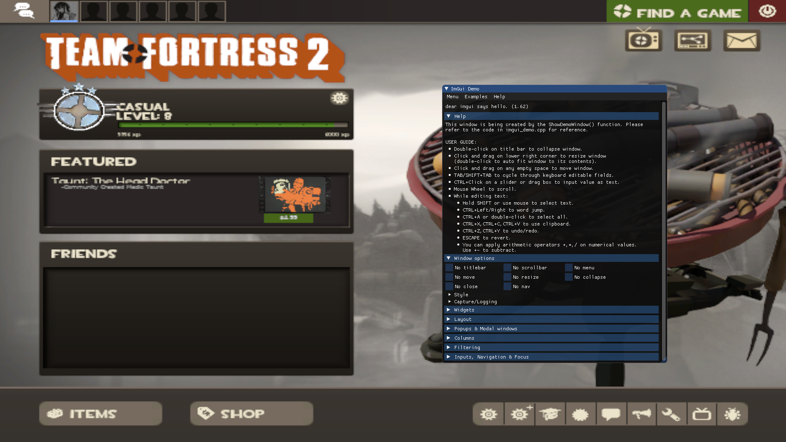

# ImGui Boilerplate for Source Games


## Summary
The code provided is heavily inspired by the work done by aixxe in [https://aixxe.net/2016/12/imgui-linux-csgo](https://aixxe.net/2016/12/imgui-linux-csgo).
They used ImGui v1.5; this one is updated for v1.62. Many functions were reworked in v1.61, and this works until the most recent version **v1.89.9**.
If you are using the default imgui files provided in ```include/imgui``` and you are unable to display the DemoWindow on screen, the offsets have likely changed.
Open up ```libSDL2-2.0.so.0``` and string search for ```The specified window has not been made current``` (for context, ripgrep the SDL2 source code for ```SDL_GL_SwapWindowWithResult```).

**Some important details:**
- Only supported on Linux
- Only works with tf2 32bit
- I have only tested this on Arch

Happy hacking!

## Building
Running ```make``` should just do the trick. Ignore the test.exe file that gets produced, or remove the second line from the Makefile.

## Injecting
- Replace ```/home/bob/Coding/cheats/mystuff/upimgui/``` with whatever path is necessary.
```
sudo gdb -ex "attach $(pidof hl2_linux)"  \
  -ex "set \$dlopen = (void*(*)(char*, int)) dlopen" \
  -ex "set \$dlclose = (int(*)(void*)) dlclose" \
  -ex "set \$library = \$dlopen(\"/home/bob/Coding/cheats/mystuff/upimgui/libsdl-imgui.so\", 1)" \
  -ex "b ImGui::ErrorCheckEndFrameSanityChecks" \
  -ex "b assert" \

call $dlclose($library)
set $library = $dlopen("/home/bob/Coding/cheats/mystuff/upimgui/libsdl-imgui.so", 1)
```
